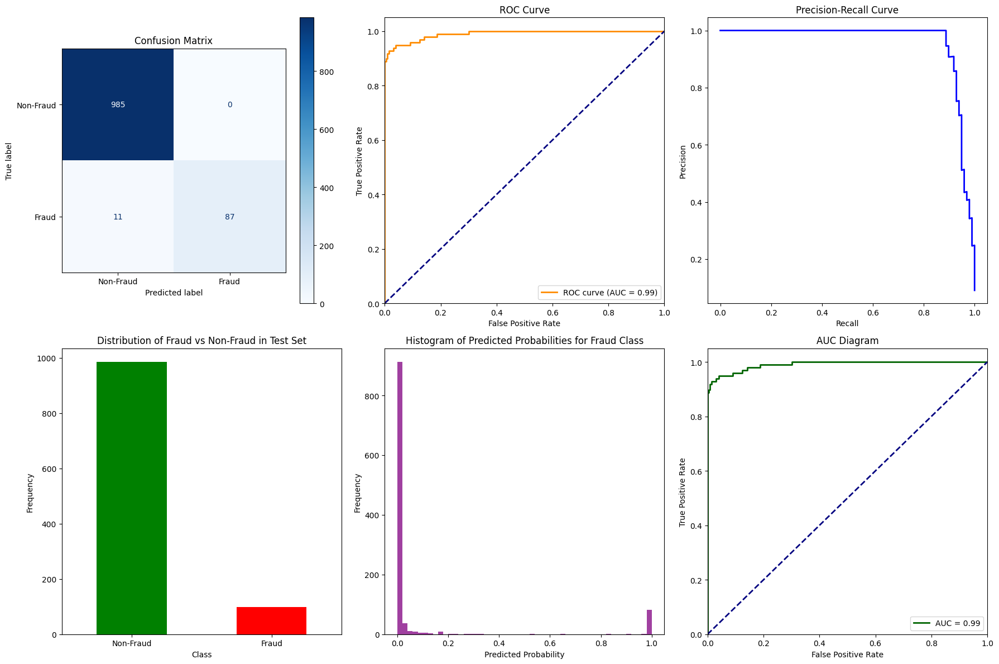
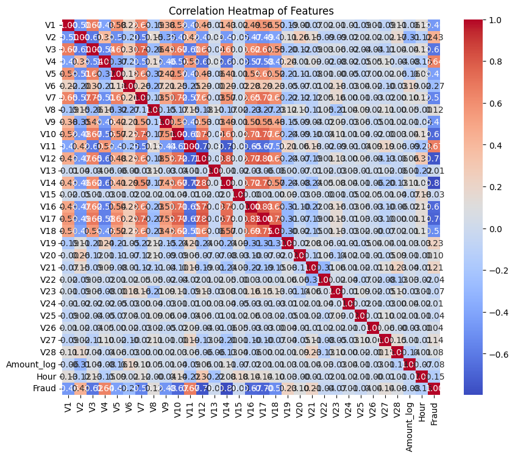

# Credit Card Fraud Detection with XGBoost

This project implements a machine learning model to detect fraudulent credit card transactions using the `XGBClassifier` algorithm. The model focuses on achieving high performance in detecting fraud (Class 1) by tuning class weights and decision thresholds through cross-validation.

## Table of Contents
- [Overview](#overview)
- [Installation](#installation)
- [Dataset](#dataset)
- [Model Training and Tuning](#model-training-and-tuning)
- [Results](#results)
- [Usage](#usage)
- [Conclusion](#conclusion)

## Overview
The goal of this project is to build a robust machine learning model capable of detecting fraudulent credit card transactions with high precision and recall. The `XGBClassifier` model is trained on a balanced dataset (with a downsampled ratio of 10:1 for non-fraud to fraud cases), and evaluated using metrics such as F1-score, Precision, and Recall, with a particular focus on the fraud class.

Key features of this implementation include:
- Class weight tuning to address class imbalance.
- Threshold optimization to improve fraud detection.
- Use of custom evaluation metrics (`custom_f1_eval`) to prioritize the F1-score for fraud detection.

## Installation

To run this project, you'll need the following libraries:
- Python 3.x
- NumPy
- Pandas
- Matplotlib
- Seaborn
- XGBoost
- Scikit-learn
- tqdm (for progress bar)
- psutil (for CPU management)

You can install the required packages using the following command:

```bash
pip install numpy pandas matplotlib seaborn xgboost scikit-learn tqdm psutil
```

## Dataset
The dataset used in this project is the [Kaggle Credit Card Fraud Detection dataset](https://www.kaggle.com/mlg-ulb/creditcardfraud). It contains transactions made by credit cards in September 2013 by European cardholders.

The dataset includes 284,807 transactions, among which only 492 are frauds, making the dataset highly imbalanced.

## Model Training and Tuning

### Preprocessing
The dataset is preprocessed as follows:
- The `Amount` feature is log-transformed to reduce skewness.
- The `Time` feature is converted to an `Hour` feature to capture temporal patterns.
- Downsampling is performed to create a balanced dataset with a non-fraud to fraud ratio of 10:1.

### Model Selection
We use the `XGBClassifier` model and tune it using cross-validation with the following parameters:
- **Class Weights:** Tested values range from 2.01 to 2.51 to address class imbalance.
- **Decision Thresholds:** Custom thresholds ranging from 0.495 to 0.505 are tested to improve fraud classification.

A custom evaluation function (`custom_f1_eval`) is used during model training to focus on optimizing the F1-score for fraud detection.

### Performance Metrics
- **F1-score:** Balances precision and recall, particularly for fraud detection.
- **Precision:** Measures the accuracy of the fraud predictions.
- **Recall:** Measures how many fraud cases are correctly identified.
- **ROC-AUC:** Evaluates the model's ability to distinguish between fraud and non-fraud cases.

## Results

### Best Model from Cross-Validation:
- **Class Weight:** 2.02
- **Threshold:** 0.495
- **F1-score (Fraud):** 0.90
- **Precision (Fraud):** 0.98
- **Recall (Fraud):** 0.83

The model achieved strong precision (0.98) and recall (0.83) for fraud detection during cross-validation, leading to an F1-score of 0.90.

### Final Model Evaluation on Test Set:
- **Final F1-score (Fraud):** 0.94
- **Final Precision (Fraud):** 1.00
- **Final Recall (Fraud):** 0.89
- **ROC-AUC Score:** 0.99

The model performed even better on the test set, achieving a perfect precision of 1.00 and a recall of 0.89. The F1-score of 0.94 reflects the model's ability to correctly identify fraud cases while minimizing false positives.

### Confusion Matrix:
|              | Non-Fraud | Fraud |
|--------------|-----------|-------|
| **Non-Fraud**| 985       | 0     |
| **Fraud**    | 11        | 87    |

The confusion matrix shows that the model correctly classified 985 non-fraud cases and 87 fraud cases, with only 11 fraud cases missed.

## Usage

To run the model, you can execute the Jupyter notebook provided. The code is divided into steps:
1. Data Preprocessing
2. Model Training and Cross-Validation
3. Model Evaluation on the Test Set
4. Plotting Results and Visualizations

Ensure you have the dataset (`creditcard.csv`) in the `./data/` folder before running the notebook.

## Project Structure

```
.
├── data/                     # Folder for the dataset
├── models/                   # Saved models and checkpoints
├── plots/                    # Output plots for evaluation
├── credit-card-fraud-detection-by-neural-network.ipynb         # Main script to run the project
├── requirements.txt           # Python dependencies
└── README.md                  # Project description
```

## Visualization

The project includes various visualizations for model performance:

- **Confusion Matrix**
- **ROC Curve**
- **Precision-Recall Curve**
- **Correlation Heatmap** for feature relationships




## Conclusion

This project demonstrates the effectiveness of using the `XGBClassifier` with class weight tuning and threshold optimization for detecting fraudulent transactions. The model achieves high precision and recall, making it suitable for real-world applications where fraud detection is critical.
